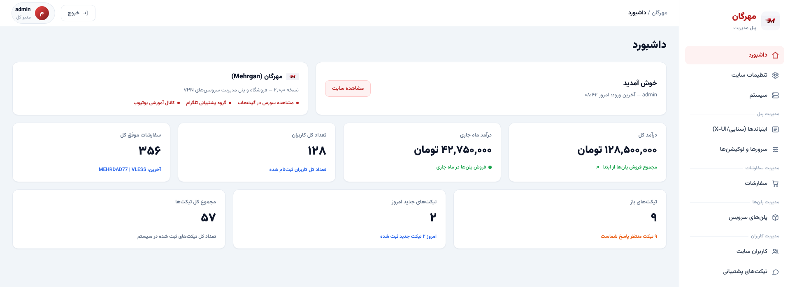
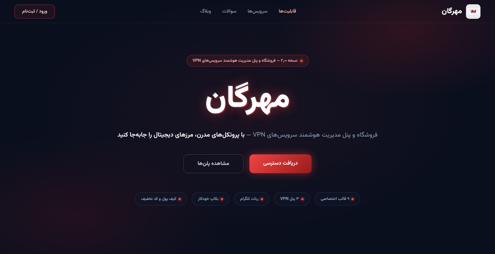
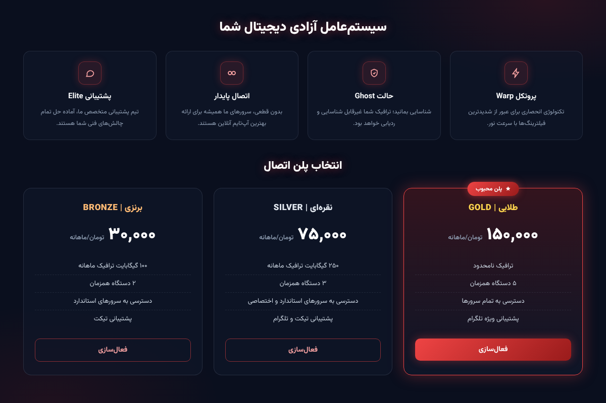

<p align="center">
  
</p>

<h1 align="center">مهرگان (Mehrgan)</h1>

<p align="center">
  فروشگاه و پنل مدیریت سرویس‌های VPN با پشتیبانی از مرزبان، Sanaei/X-UI و PasarGuard
</p>

<p align="center">
  <a href="https://github.com/ehssanehs/Mehrgan"></a>
  <a href="https://www.php.net/"></a>
  <a href="https://filamentphp.com/"></a>
  <a href="https://opensource.org/licenses/MIT"></a>
</p>

> رابط کاربری پروژه و بیشتر بخش‌های پنل به‌صورت پیش‌فرض فارسی است.

<p align="center">
  
  
  <br>
  
</p>

## فهرست مطالب

- [مهرگان چیست؟](#مهرگان-چیست)
- [امکانات](#امکانات)
- [ساختار پروژه](#ساختار-پروژه)
- [پیش‌نیازها](#پیشنیازها)
- [روش‌های نصب](#روشهای-نصب)
  - [نصب خودکار در Ubuntu](#۱-نصب-خودکار-در-ubuntu)
  - [نصب دستی روی سرور](#۲-نصب-دستی-روی-سرور)
- [تنظیمات اولیه بعد از نصب](#تنظیمات-اولیه-بعد-از-نصب)
- [اتصال پنل VPN](#اتصال-پنل-vpn)
- [راه‌اندازی ربات تلگرام](#راهاندازی-ربات-تلگرام)
- [پرداخت و سفارش](#پرداخت-و-سفارش)
- [آپدیت و مدیریت سرور](#آپدیت-و-مدیریت-سرور)
- [بکاپ و بازیابی](#بکاپ-و-بازیابی)
- [تست و توسعه](#تست-و-توسعه)
- [مسیرها و APIها](#مسیرها-و-apiها)
- [تنظیمات محیطی](#تنظیمات-محیطی)
- [نکات امنیتی و محدودیت‌ها](#نکات-امنیتی-و-محدودیتها)
- [پشتیبانی](#پشتیبانی)

## مهرگان چیست؟

مهرگان یک نرم‌افزار کامل برای فروش و مدیریت سرویس‌های VPN است. این پروژه بخش‌های زیر را در یک سیستم جمع می‌کند:

- سایت فروش و نمایش پلن‌ها.
- پنل مدیریت Filament در مسیر `/admin`.
- ربات تلگرام برای خرید، تحویل لینک، پشتیبانی و مدیریت حساب.
- مدیریت چند سرور، لوکیشن و ظرفیت.
- اتصال مستقیم به پنل‌های Marzban، Sanaei/X-UI و PasarGuard.
- کیف پول، پرداخت، کد تخفیف، سیستم دعوت، تیکت، وبلاگ، نمایندگی و بکاپ.

این مخزن شامل سایت و سرویس‌های سمت سرور است. اپلیکیشن native اندروید، iOS یا ویندوز داخل این مخزن وجود ندارد؛ ربات تلگرام فقط آموزش اتصال با V2RayNG، V2Box/Streisand و V2RayN را نمایش می‌دهد.

## امکانات

### سایت و حساب کاربری

- صفحه اصلی با نمایش پلن‌های فعال، قیمت، حجم، مدت و امکانات.
- ۹ قالب قابل انتخاب برای سایت، صفحات ورود و پنل مدیریت:
  `welcome`، `rocket`، `arcane`، `cyberpunk`، `dragon`، `phoenix`، `nebula`، `aurora` و `obsidian`.
- ثبت‌نام، ورود، خروج، فراموشی رمز، تغییر رمز و صفحات تأیید ایمیل.
- داشبورد کاربر شامل:
  - سرویس‌های فعال و سرویس‌هایی که به‌تازگی منقضی شده‌اند.
  - لینک اتصال و تاریخ انقضا.
  - تمدید سرویس.
  - کیف پول و تاریخچه تراکنش‌ها.
  - تاریخچه سفارش‌ها و وضعیت پرداخت.
  - اعلان‌ها و علامت‌گذاری اعلان‌های خوانده‌شده.
  - تیکت‌های پشتیبانی.
- ویرایش پروفایل و حذف حساب.
- امکان مسدودسازی و رفع مسدودی کاربران توسط مدیر. کاربر مسدودشده هم از سایت و هم از ربات تلگرام خارج می‌شود.

### پلن، سفارش و ساخت سرویس

- ساخت پلن با نام، قیمت، حجم به گیگابایت، مدت به روز، امکانات، وضعیت فعال و پلن محبوب.
- محدود کردن پلن به نوع سرور مشخص.
- انتخاب سرور بر اساس لوکیشن و ظرفیت.
- انتخاب خودکار سرور دارای ظرفیت در صورت انتخاب نکردن سرور توسط کاربر.
- ساخت یا بروزرسانی کاربر در پنل VPN و ذخیره لینک در سفارش.
- تمدید سرویس روی همان نام کاربری قبلی، در صورت پشتیبانی پنل.
- مشاهده و ویرایش اطلاعات ذخیره‌شده سرویس از پنل مدیریت.

> ویرایش لینک در پنل مهرگان فقط اطلاعات دیتابیس مهرگان را تغییر می‌دهد و پنل VPN از راه دور را تغییر نمی‌دهد.

### پنل‌های VPN پشتیبانی‌شده

| پنل | امکانات | نوع لینک |
|---|---|---|
| **Sanaei / X-UI** | ورود، دریافت اینباند، ساخت کاربر، ویرایش، ریست مصرف، غیرفعال‌سازی و جستجوی UUID | لینک تکی VLESS، لینک سابسکریپشن یا لینک تونل‌شده |
| **Marzban** | ورود با توکن، ساخت و ویرایش کاربر، دریافت اطلاعات، ریست مصرف، غیرفعال‌سازی و جستجوی UUID | لینک سابسکریپشن پنل و Node Hostname اختیاری |
| **PasarGuard** | ورود با توکن، ساخت و ویرایش کاربر، دریافت اطلاعات، ریست مصرف، غیرفعال‌سازی و جستجوی UUID | لینک سابسکریپشن پنل و Node Hostname اختیاری |

هم تنظیمات جدید MultiServer و هم تنظیمات قدیمی تک‌سرور پشتیبانی می‌شوند. برای نصب جدید، استفاده از MultiServer پیشنهاد می‌شود.

در فرم فعلی پلن‌ها، فیلتر نوع سرور شامل `all`، `xui` و `marzban` است. سرویس‌های PasarGuard در بخش‌های اتصال و نمایندگی پشتیبانی می‌شوند؛ برای ساخت پلن اختصاصی PasarGuard باید این محدودیت فرم/enum را در صورت نیاز توسعه دهید.

### پرداخت، کیف پول و تخفیف

- پرداخت کارت‌به‌کارت با امکان تعریف چند کارت بانکی.
- نمایش تصادفی یکی از کارت‌ها به کاربر.
- ارسال تصویر رسید پرداخت و بررسی آن توسط مدیر.
- شارژ کیف پول با رسید و تأیید مدیر.
- خرید و تمدید سریع با موجودی کیف پول.
- افزایش یا کاهش دستی موجودی کاربر توسط مدیر همراه با ثبت توضیح.
- کد تخفیف درصدی یا مبلغ ثابت.
- محدودیت تعداد استفاده کلی و تعداد استفاده هر کاربر.
- حداقل مبلغ سفارش و سقف تخفیف.
- زمان شروع و پایان کد تخفیف.
- محدود کردن کد به پلن‌های مشخص، شارژ کیف پول یا تمدید.
- وب‌هوک NOWPayments در مسیر `/webhooks/nowpayments`.
- گزینه پرداخت ارز دیجیتال در وضعیت فعلی فقط اطلاع‌رسانی است و درگاه کامل محسوب نمی‌شود.

### ربات تلگرام

ربات تلگرام از Webhook، کیبورد معمولی و Inline Keyboard استفاده می‌کند و امکانات زیر را دارد:

- ثبت‌نام خودکار کاربر با `/start`.
- لینک دعوت تلگرام مانند `/start REF-ABC123`.
- نمایش پلن‌ها بر اساس مدت و حجم.
- انتخاب لوکیشن و سرور.
- انتخاب نام کاربری یا تولید نام ترتیبی.
- مشاهده موجودی و تاریخچه تراکنش‌ها.
- شارژ کیف پول و خرید با کیف پول.
- پرداخت کارت‌به‌کارت و ارسال تصویر رسید.
- مشاهده سرویس‌ها، لینک اتصال، تمدید و QR Code.
- ارسال خودکار لینک سرویس پس از تأیید سفارش.
- تقسیم لینک‌های طولانی در چند پیام تلگرام.
- وارد کردن اشتراک قبلی با VLESS یا Subscription URL.
- ساخت اکانت تست با حجم، مدت و محدودیت قابل تنظیم.
- سیستم دعوت و نمایش درآمد دعوت.
- سوالات متداول و آموزش اتصال اندروید، iOS و ویندوز.
- ساخت تیکت، پاسخ به تیکت و ارسال پیوست.
- اجبار عضویت در کانال تلگرام.
- ثبت‌نام و امکانات نمایندگی.
- تأیید یا رد پرداخت و پاسخ به تیکت توسط ادمین.
- ارسال پیام همگانی از طریق صف پردازش.

متن خوش‌آمدگویی، متن آموزش‌ها، FAQ، مبالغ شارژ، Chat ID مدیران و نمایش دکمه‌های ربات از پنل مدیریت قابل تنظیم است.

### وارد کردن اشتراک قبلی

کاربر می‌تواند از سایت، در مسیر `/subscription/import`، یا از ربات تلگرام اشتراک قبلی خود را وارد کند.

ورودی‌های قابل قبول:

1. یک لینک تکی `vless://...`.
2. یک لینک `http://` یا `https://` که محتوای آن شامل لینک‌های VLESS باشد.

مراحل وارد کردن:

1. تشخیص نوع ورودی و اعتبارسنجی آن.
2. دریافت محتوای Subscription URL.
3. Decode کردن Base64 در صورت نیاز.
4. استفاده از UUID اولین لینک VLESS معتبر.
5. جلوگیری از وارد کردن UUID تکراری.
6. جستجو در سرورهای فعال MultiServer و تنظیمات قدیمی X-UI، Marzban و PasarGuard.
7. خواندن نام کاربری، حجم، مصرف، تاریخ انقضا و لینک اشتراک از پنل.
8. ساخت یک سفارش پرداخت‌شده برای کاربر.

برای کاهش خطر SSRF، ورودی حداکثر ۱۰٬۰۰۰ کاراکتر است، فقط HTTP/HTTPS قبول می‌شود و localhost و IPهای خصوصی بررسی و مسدود می‌شوند. مسیر API سایت این قابلیت `POST /subscription/import/api` است و همچنان به ورود کاربر نیاز دارد.

### نام‌گذاری ترتیبی کلاینت‌ها

از پنل مدیریت می‌توان نام‌گذاری ترتیبی را فعال کرد:

- فعال یا غیرفعال‌سازی سیستم.
- تعیین پیشوند، مانند `server1u`.
- مشاهده شمارنده فعلی و نام بعدی.
- ریست شمارنده.
- جلوگیری از تکرار شماره با قفل دیتابیس.
- تغییر پیشوند باعث شروع شمارنده از ۱ می‌شود.
- نام سفارشی کاربر همیشه اولویت دارد.
- اگر سیستم خاموش باشد، الگوی قدیمی `user-{id}-order-{id}` استفاده می‌شود.

### سیستم دعوت

- ساخت کد دعوت یکتا برای کاربران.
- لینک دعوت در سایت و ربات تلگرام.
- پاداش ثابت یا درصدی برای معرف.
- هدیه خوش‌آمدگویی برای کاربر جدید.
- پاداش فقط برای اولین خرید موفق.
- حداقل مبلغ خرید برای دریافت پاداش.
- بررسی IP تکراری برای جلوگیری از سوءاستفاده از هدیه.
- ارسال اعلان تلگرام برای معرف و کاربر جدید.
- گزارش تعداد ثبت‌نام، خرید موفق، درآمد و موجودی کیف پول.

### اکانت تست و QR Code

- فعال یا غیرفعال کردن اکانت تست.
- تعیین سرور مخصوص تست.
- تعیین حجم به MB، مدت به ساعت و تعداد دفعات مجاز هر کاربر.
- ساخت لینک تست از ربات تلگرام.
- کپی لینک و دریافت QR Code.
- ساخت QR Code برای سرویس‌های خریداری‌شده و اکانت‌های نمایندگی در صورت وجود لینک.

### تیکت، اعلان و وبلاگ

- تیکت پشتیبانی با اولویت کم، متوسط و زیاد.
- وضعیت‌های باز، پاسخ‌داده‌شده و بسته‌شده.
- پاسخ از سایت یا تلگرام.
- پیوست JPG، PNG، PDF و ZIP تا حجم ۵ مگابایت.
- ارسال اعلان پاسخ تیکت در تلگرام.
- وبلاگ در مسیر `/blog`.
- دسته‌بندی، اسلاگ، تصویر شاخص، محتوای Rich Editor و پست‌های مرتبط.
- زمان‌بندی انتشار و فیلدهای SEO.
- شمارش بازدید پست‌ها.
- ارسال پیام همگانی تلگرام با استفاده از Queue.
- گزارش سود و فروش بر اساس بازه زمانی.

### نمایندگی و فروشنده‌ها

ماژول `Reseller` امکانات زیر را دارد:

- پلن نمایندگی سهمیه‌ای یا پرداخت به‌ازای هر اکانت.
- ثبت درخواست نمایندگی و تأیید یا رد توسط مدیر.
- کیف پول نماینده و تراکنش‌های آن.
- تعریف سرور و محصول VPN برای نماینده.
- پشتیبانی از Sanaei/X-UI، Marzban و PasarGuard در سرویس نمایندگی.
- ساخت اکانت در Queue با چند بار تلاش مجدد.
- برگشت خودکار مبلغ در صورت شکست دائمی ساخت اکانت.
- ذخیره وضعیت، تاریخ انقضا، لینک اشتراک و پاسخ خام پنل.
- ساخت QR Code برای اکانت نماینده.
- API نمایندگی در مسیر `/api/v1/reseller`.

مدل‌های قدیمی `Agent`، `AgentServer` و `AgentTransaction` نیز برای سازگاری در پروژه باقی مانده‌اند.

### بکاپ و مدیریت ماژول‌ها

- ساخت فایل ZIP شامل Dump دیتابیس، اطلاعات نسخه و فایل‌های `storage/app/public`.
- ساخت، آپلود، دانلود، بازیابی و حذف بکاپ از پنل مدیریت.
- ارسال بکاپ به یک یا چند Chat ID تلگرام مدیر.
- اجرای روزانه دستور `backup:daily-telegram` با Laravel Scheduler.
- نصب ماژول ZIP از پنل.
- فعال‌سازی، غیرفعال‌سازی و حذف ماژول‌ها.
- مدیریت ماژول‌ها با `nwidart/laravel-modules`.

## ساختار پروژه

```text
app/                         کدهای اصلی، مدل‌ها، سرویس‌ها و کنترلرها
Modules/
  Blog/                      وبلاگ و مدیریت محتوای آن
  MatinBackup/               بکاپ و ارسال بکاپ به تلگرام
  MultiServer/               لوکیشن، سرور، ظرفیت و اتصال پنل‌ها
  Referral/                  گزارش و منطق سیستم دعوت
  Reseller/                  نمایندگی، کیف پول، محصول و API
  TelegramBot/               وب‌هوک و منطق ربات تلگرام
  Ticketing/                 تیکت پشتیبانی
 database/migrations/        مایگریشن‌های دیتابیس
 resources/views/            قالب‌ها، داشبورد، پرداخت و احراز هویت
 public/themes/              قالب‌های ظاهری سایت
 routes/                     مسیرهای سایت و احراز هویت
 install.sh                  نصب خودکار چند نمونه
 update.sh                   آپدیت یک نمونه
 manage.sh                   مدیریت Workerها
 uninstall.sh                حذف کامل یک نمونه
```

تمام ماژول‌های موجود در `modules_statuses.json` در حالت پیش‌فرض فعال هستند و Resourceهای آن‌ها به‌صورت خودکار در Filament شناسایی می‌شوند.

## پیش‌نیازها

### نرم‌افزارهای موردنیاز

- Ubuntu 22.04 برای استفاده از اسکریپت نصب خودکار.
- PHP نسخه **8.3 یا بالاتر** با افزونه‌های زیر:
  `bcmath`، `curl`، `dom`، `gd`، `intl`، `mbstring`، `PDO MySQL`، `redis`، `xml` و `zip`.
- Composer 2.
- Node.js LTS و npm.
- MySQL 8 یا MariaDB.
- Redis.
- Nginx.
- Supervisor برای اجرای Queue Worker.
- Cron یا systemd timer برای اجرای Scheduler.
- دامنه‌ای که به IP سرور اشاره کند.
- گواهی SSL برای سایت و Webhook تلگرام.

### سرویس‌های خارجی

- یک پنل قابل دسترس Marzban، Sanaei/X-UI یا PasarGuard.
- توکن ربات تلگرام در صورت فعال بودن ربات.
- SMTP واقعی در صورت نیاز به ارسال ایمیل تأیید و بازیابی رمز.
- دامنه Subscription یا Tunnel برای حالت‌های خاص X-UI.

## روش‌های نصب

### ۱. نصب خودکار در Ubuntu

اسکریپت `install.sh` چند نمونه مستقل از مهرگان نصب می‌کند. هر نمونه پوشه، دیتابیس، سایت Nginx، Worker و Cron جداگانه دارد.

#### مرحله ۱: تنظیم DNS و ورود به سرور

یک رکورد A یا AAAA بسازید، برای مثال:

```text
vpn.example.com -> IP_SERVER
```

سپس با SSH و کاربر دارای دسترسی `sudo` وارد سرور شوید. پورت‌های ۲۲، ۸۰ و ۴۴۳ باید باز باشند.

#### مرحله ۲: دریافت پروژه و اجرای نصب

بهتر است کل پروژه را Clone کنید؛ چون اسکریپت نصب در بعضی شرایط به `uninstall.sh` و فایل‌های دیگر نیاز دارد:

```bash
cd /tmp
git clone https://github.com/ehssanehs/Mehrgan.git
cd Mehrgan
sudo bash install.sh
```

اسکریپت نصب در حال حاضر برای هر نمونه، کد را از Branch اصلی `main` دریافت می‌کند.

#### مرحله ۳: پاسخ به سوال‌های نصب

اگر اعلام کنید پیش‌نیازها نصب نیستند، اسکریپت موارد زیر را نصب و فعال می‌کند:

- Nginx، MySQL، Redis، Supervisor و Certbot.
- PHP 8.3 و افزونه‌های لازم.
- Node.js LTS و npm.
- Composer.

برای هر نمونه باید موارد زیر را وارد کنید:

1. نام پوشه، مانند `mehrgan-1`.
2. دامنه، مانند `vpn.example.com`.
3. نام دیتابیس، نام کاربر دیتابیس و رمز دیتابیس.
4. ایمیل و رمز اولیه مدیر.
5. ایمیل دریافت گواهی SSL.
6. فعال یا غیرفعال بودن SSL.

اسکریپت سپس کد را Clone می‌کند، دیتابیس را می‌سازد، فایل `.env` را تنظیم می‌کند، وابستگی‌ها را نصب می‌کند، مایگریشن و Seed را اجرا می‌کند، Storage Link می‌سازد، Assetها را Build می‌کند و تنظیمات Nginx، Supervisor و Cron را ایجاد می‌کند.

> **هشدار:** شاخه نصب پیش‌نیازها برای سرور Ubuntu تمیز طراحی شده است و قبل از نصب PHP 8.3 ممکن است PHPهای قبلی را حذف کند. اگر روی سرور برنامه دیگری دارید، قبل از اجرا بکاپ بگیرید یا گزینه نصب پیش‌نیازها را با دقت انتخاب کنید.

#### مرحله ۴: بررسی نصب

پس از پایان نصب، سایت و پنل مدیریت را باز کنید:

```text
https://vpn.example.com/
https://vpn.example.com/admin
```

و وضعیت سرویس‌ها را ببینید:

```bash
sudo supervisorctl status
sudo systemctl status nginx php8.3-fpm mysql redis-server supervisor
```

سپس بخش [تنظیمات اولیه بعد از نصب](#تنظیمات-اولیه-بعد-از-نصب) را انجام دهید.

### ۲. نصب دستی روی سرور

این روش برای سروری مناسب است که از قبل Web Stack دارد یا می‌خواهید تمام مراحل را خودتان کنترل کنید. در دستورات زیر `/var/www/mehrgan` و `vpn.example.com` را با مقادیر خودتان جایگزین کنید.

#### مرحله ۱: نصب پکیج‌ها

```bash
sudo apt update
sudo apt install -y git curl unzip zip build-essential nginx mysql-server redis-server supervisor \
  certbot python3-certbot-nginx software-properties-common

sudo add-apt-repository -y ppa:ondrej/php
sudo apt update
sudo apt install -y php8.3 php8.3-cli php8.3-fpm php8.3-mysql php8.3-mbstring \
  php8.3-xml php8.3-curl php8.3-zip php8.3-bcmath php8.3-intl php8.3-gd \
  php8.3-dom php8.3-redis
```

نصب Node.js LTS و Composer در صورت نصب نبودن:

```bash
curl -fsSL https://deb.nodesource.com/setup_lts.x | sudo -E bash -
sudo apt install -y nodejs

php -r "copy('https://getcomposer.org/installer', 'composer-setup.php');"
sudo php composer-setup.php --install-dir=/usr/local/bin --filename=composer
rm composer-setup.php
```

فعال‌سازی سرویس‌ها:

```bash
sudo systemctl enable --now nginx php8.3-fpm mysql redis-server supervisor
```

#### مرحله ۲: ساخت دیتابیس

با یک کاربر جداگانه برای برنامه، دیتابیس بسازید:

```bash
sudo mysql
```

```sql
CREATE DATABASE mehrgan CHARACTER SET utf8mb4 COLLATE utf8mb4_unicode_ci;
CREATE USER 'mehrgan_app'@'localhost' IDENTIFIED BY 'یک-رمز-طولانی-و-قوی';
GRANT ALL PRIVILEGES ON mehrgan.* TO 'mehrgan_app'@'localhost';
FLUSH PRIVILEGES;
EXIT;
```

#### مرحله ۳: دریافت پروژه

```bash
sudo mkdir -p /var/www
sudo git clone https://github.com/ehssanehs/Mehrgan.git /var/www/mehrgan
sudo chown -R www-data:www-data /var/www/mehrgan
cd /var/www/mehrgan
```

#### مرحله ۴: ساخت فایل `.env`

```bash
sudo -u www-data cp .env.example .env
sudo -u www-data nano .env
```

مقادیر اصلی را مانند نمونه زیر تنظیم کنید:

```dotenv
APP_NAME=Mehrgan
APP_ENV=production
APP_DEBUG=false
APP_URL=https://vpn.example.com

ADMIN_EMAIL=admin@example.com
ADMIN_PASSWORD=قبل-از-نصب-تغییر-دهید

DB_CONNECTION=mysql
DB_HOST=127.0.0.1
DB_PORT=3306
DB_DATABASE=mehrgan
DB_USERNAME=mehrgan_app
DB_PASSWORD=رمز-دیتابیس

SESSION_DRIVER=database
CACHE_STORE=database
QUEUE_CONNECTION=redis
FILESYSTEM_DISK=local

REDIS_CLIENT=phpredis
REDIS_HOST=127.0.0.1
REDIS_PORT=6379
REDIS_PASSWORD=null
```

در محیط واقعی حتماً `APP_DEBUG=false` باشد. مقادیر `ADMIN_EMAIL` و `ADMIN_PASSWORD` فقط در Seed اولیه استفاده می‌شوند و اجرای دوباره Seed رمز مدیر موجود را تغییر نمی‌دهد.

#### مرحله ۵: نصب وابستگی‌ها

```bash
cd /var/www/mehrgan
sudo -u www-data composer install --no-dev --optimize-autoloader --no-interaction
sudo -u www-data HOME=/var/www npm ci
sudo -u www-data php artisan key:generate --force
```

اگر `package-lock.json` در Branch شما تغییر کرده است، به‌جای `npm ci` از `npm install` استفاده کنید و تغییرات Lockfile را بررسی کنید.

#### مرحله ۶: مایگریشن، Storage و Build

```bash
sudo -u www-data php artisan migrate --seed --force
sudo -u www-data php artisan storage:link
sudo -u www-data HOME=/var/www npm run build

sudo chown -R www-data:www-data storage bootstrap/cache
sudo chmod -R ug+rwX storage bootstrap/cache
```

پوشه `public/build` در Git نگهداری نمی‌شود؛ بنابراین بعد از هر نصب یا تغییر Frontend باید `npm run build` اجرا شود.

#### مرحله ۷: تنظیم Nginx

فایل زیر را بسازید:

```text
/etc/nginx/sites-available/mehrgan
```

محتوای پیشنهادی:

```nginx
server {
    listen 80;
    listen [::]:80;
    server_name vpn.example.com;

    root /var/www/mehrgan/public;
    index index.php;
    client_max_body_size 10M;

    location / {
        try_files $uri $uri/ /index.php?$query_string;
    }

    location ~ \.php$ {
        include snippets/fastcgi-php.conf;
        fastcgi_pass unix:/run/php/php8.3-fpm.sock;
        fastcgi_param SCRIPT_FILENAME $realpath_root$fastcgi_script_name;
    }

    location ~ /\.(?!well-known).* {
        deny all;
    }
}
```

فعال‌سازی و بررسی:

```bash
sudo ln -s /etc/nginx/sites-available/mehrgan /etc/nginx/sites-enabled/mehrgan
sudo nginx -t
sudo systemctl reload nginx
```

#### مرحله ۸: تنظیم Queue Worker با Supervisor

فایل زیر را بسازید:

```text
/etc/supervisor/conf.d/mehrgan-worker.conf
```

```ini
[program:mehrgan-worker]
process_name=%(program_name)s_%(process_num)02d
command=php /var/www/mehrgan/artisan queue:work redis --sleep=3 --tries=3 --max-time=3600
directory=/var/www/mehrgan
autostart=true
autorestart=true
stopasgroup=true
killasgroup=true
user=www-data
numprocs=2
redirect_stderr=true
stdout_logfile=/var/log/supervisor/mehrgan-worker.log
stopwaitsecs=3600
```

سپس:

```bash
sudo supervisorctl reread
sudo supervisorctl update
sudo supervisorctl start "mehrgan-worker:*"
sudo supervisorctl status
```

Worker برای پیام همگانی تلگرام و ساخت اکانت‌های نمایندگی لازم است و برای نصب Production توصیه می‌شود.

#### مرحله ۹: فعال‌سازی Scheduler

فایل `/etc/cron.d/mehrgan` را بسازید:

```cron
* * * * * www-data cd /var/www/mehrgan && php artisan schedule:run >> /dev/null 2>&1
```

#### مرحله ۱۰: فعال‌سازی SSL

بعد از تنظیم DNS و اطمینان از کار کردن HTTP:

```bash
sudo certbot --nginx -d vpn.example.com -m admin@example.com --agree-tos --redirect
```

بعد از SSL، مقدار `APP_URL` را بررسی کنید و Cache را بازسازی کنید:

```bash
sudo -u www-data php artisan optimize:clear
sudo -u www-data php artisan config:cache
sudo -u www-data php artisan view:cache
```

#### مرحله ۱۱: بررسی نهایی

```bash
curl -I https://vpn.example.com
sudo supervisorctl status
sudo -u www-data php artisan about
```

## تنظیمات اولیه بعد از نصب

### ۱. ورود به پنل مدیر

به مسیر `/admin` بروید و با ایمیل و رمزی که هنگام نصب تعیین کرده‌اید وارد شوید. اگر رمز پیش‌فرض استفاده شده است، بلافاصله آن را تغییر دهید.

### ۲. تنظیم سایت و پرداخت

در بخش تنظیمات سایت:

- قالب فعال را انتخاب کنید.
- نام برند، متن Hero، قیمت‌گذاری، FAQ و Footer را تنظیم کنید.
- کارت‌های بانکی و توضیحات کارت‌به‌کارت را وارد کنید.
- لینک‌های شبکه‌های اجتماعی را تنظیم کنید.
- لینک ورود سایت برای ربات را وارد کنید.

### ۳. ساخت لوکیشن و سرور

در **MultiServer → Locations** کشورها و لوکیشن‌ها را بسازید.

سپس در **MultiServer → Servers** برای هر سرور این موارد را وارد کنید:

- لوکیشن.
- نوع پنل: X-UI/Sanaei، Marzban یا PasarGuard.
- دامنه یا IP، پورت و Path.
- HTTPS.
- نام کاربری و رمز پنل.
- Inbound ID برای X-UI.
- Node Hostname برای Marzban/PasarGuard در صورت نیاز.
- ظرفیت و وضعیت فعال بودن.
- نوع لینک خروجی: `single`، `subscription` یا `tunnel`.

سرور را فقط بعد از تست اتصال فعال کنید.

### ۴. ساخت پلن

در بخش پلن‌های سرویس، حداقل یک پلن فعال بسازید:

- نام و قیمت.
- حجم به GB.
- مدت به روز.
- امکانات، هر مورد در یک خط.
- نوع سرور قابل استفاده.
- وضعیت فعال و محبوب.

### ۵. راه‌اندازی تلگرام

توکن و Chat ID را طبق بخش [راه‌اندازی ربات تلگرام](#راهاندازی-ربات-تلگرام) تنظیم کنید و با `/start` ربات را تست کنید.

### ۶. امکانات اختیاری

- اکانت تست.
- سیستم دعوت.
- FAQ و آموزش اتصال.
- اجبار عضویت در کانال.
- کدهای تخفیف.
- بکاپ تلگرام.
- پلن‌ها و محصولات نمایندگی.

### ۷. تست کامل

قبل از فروش واقعی این موارد را تست کنید:

1. ثبت‌نام و ورود سایت.
2. `/start` و نمایش پلن‌ها در ربات.
3. خرید یک پلن کم‌حجم روی هر نوع پنل.
4. پرداخت کارت‌به‌کارت و تأیید رسید.
5. شارژ کیف پول و خرید با کیف پول.
6. ارسال لینک، کپی لینک و QR Code در تلگرام.
7. تمدید و ریست مصرف.
8. کد تخفیف و پاداش دعوت.
9. ساخت و پاسخ تیکت.
10. Queue، Scheduler و بکاپ.

## اتصال پنل VPN

### روش پیشنهادی MultiServer

1. یک لوکیشن بسازید.
2. یک سرور فعال در آن لوکیشن بسازید.
3. نوع پنل را انتخاب کنید.
4. اطلاعات ورود را وارد کنید.
5. در X-UI، Inbound فعال و صحیح را انتخاب کنید.
6. حالت لینک خروجی را تنظیم کنید.
7. یک پلن سازگار بسازید.
8. یک خرید آزمایشی انجام دهید.
9. ظاهر شدن کاربر در پنل VPN و صحت لینک را بررسی کنید.

### حالت قدیمی تک‌سرور

برای سازگاری با نسخه‌های قدیمی، کلیدهای `xui_*`، `marzban_*` و `pasarguard_*` در جدول `settings` نیز پشتیبانی می‌شوند. برای نصب جدید MultiServer بهتر است.

### بررسی ارتباط سرور

از خود سرور مهرگان مطمئن شوید که:

- دامنه پنل Resolve می‌شود.
- پورت پنل باز است.
- کاربر API می‌تواند Login کند.
- Inbound فعال است.
- دامنه Subscription یا Tunnel به مقصد درست اشاره می‌کند.
- واحد حجم و زمان با API پنل هماهنگ است.

## راه‌اندازی ربات تلگرام

### ۱. ساخت Bot

در BotFather یک Bot بسازید و Token آن را محرمانه نگه دارید.

### ۲. ذخیره Token و Chat ID

در پنل مدیریت، تنظیمات تلگرام را باز کنید و این موارد را وارد کنید:

- `telegram_bot_token`.
- یک یا چند `telegram_admin_chat_id` عددی.
- `site_login_url` در صورت نیاز.
- تنظیمات اجباری عضویت در کانال.
- نمایش یا عدم نمایش دکمه تست و نمایندگی.

توکن اصلی ربات از تنظیمات دیتابیس خوانده می‌شود. مقدار `TELEGRAM_BOT_TOKEN` در `.env` فقط Fallback پکیج تلگرام است؛ روش پیشنهادی، ذخیره Token در پنل است.

اگر سرور برای اتصال به تلگرام Proxy دارد، در `.env` مقدار `TELEGRAM_PROXY` را تنظیم کنید.

اگر اجبار عضویت فعال است، Bot را در کانال به‌عنوان Administrator اضافه کنید تا بتواند عضویت کاربر را بررسی کند.

### ۳. ثبت Webhook

بعد از تنظیم `APP_URL` روی دامنه عمومی HTTPS و ذخیره Token در پنل، اجرا کنید:

```bash
sudo -u www-data php artisan telegram:set-webhook
```

Webhook در این مسیر ثبت می‌شود:

```text
https://your-domain.example/webhooks/telegram
```

### ۴. تست ربات

در ربات `/start` را بفرستید و این موارد را بررسی کنید:

- نمایش پلن‌ها.
- وارد کردن اشتراک.
- اکانت تست.
- ارسال رسید.
- ساخت تیکت.
- دریافت لینک سرویس.

برای خطاها فایل زیر را بررسی کنید:

```text
storage/logs/laravel.log
```

## پرداخت و سفارش

### خرید از سایت

1. کاربر پلن را انتخاب می‌کند.
2. سفارش در وضعیت Pending ساخته می‌شود.
3. در حالت چندسروری، سرور انتخاب می‌شود.
4. کد تخفیف در صورت وجود اعمال می‌شود.
5. پرداخت با کیف پول یا کارت انجام می‌شود.
6. پرداخت کیف پول به‌صورت آنی پردازش می‌شود.
7. پرداخت کارت‌به‌کارت منتظر تأیید مدیر می‌ماند.
8. پس از تأیید، کاربر در پنل VPN ساخته و لینک ذخیره می‌شود.
9. کاربر از سایت و تلگرام اعلان دریافت می‌کند.

### محدودیت رسید

- رسید کارت در سایت: تصویر حداکثر ۲ مگابایت.
- پیوست تیکت: JPG، JPEG، PNG، PDF یا ZIP حداکثر ۵ مگابایت.
- در Nginx مقدار `client_max_body_size` حداقل ۱۰ مگابایت باشد.
- دستور `php artisan storage:link` باید اجرا شده باشد.

## آپدیت و مدیریت سرور

### روش دستی پیشنهادی

قبل از آپدیت از دیتابیس و `.env` بکاپ بگیرید:

```bash
cd /var/www/mehrgan
sudo cp .env ".env.backup.$(date +%Y%m%d-%H%M%S)"
sudo -u www-data php artisan down --retry=60

sudo -u www-data git fetch origin --prune
sudo -u www-data git pull --ff-only origin main
sudo -u www-data composer install --no-dev --optimize-autoloader --no-interaction
sudo -u www-data HOME=/var/www npm ci
sudo -u www-data HOME=/var/www npm run build
sudo -u www-data php artisan migrate --force
sudo -u www-data php artisan storage:link || true
sudo -u www-data php artisan optimize:clear
sudo -u www-data php artisan config:cache
sudo -u www-data php artisan view:cache
sudo -u www-data php artisan event:cache
sudo supervisorctl restart "mehrgan-worker:*"
sudo -u www-data php artisan up
```

اگر آپدیت در حالت Maintenance متوقف شد:

```bash
cd /var/www/mehrgan
sudo -u www-data php artisan optimize:clear
sudo -u www-data php artisan up
sudo supervisorctl status
```

### اسکریپت `update.sh`

برای یک نمونه نصب‌شده:

```bash
cd /var/www/mehrgan-1
sudo bash update.sh
```

یا با مسیر مشخص:

```bash
sudo bash update.sh --path=/var/www/mehrgan-1
```

این اسکریپت `.env` را بکاپ می‌گیرد، سایت را Maintenance می‌کند، کد را دریافت می‌کند، Composer و npm را اجرا می‌کند، مایگریشن را انجام می‌دهد، Worker را ری‌استارت می‌کند و Cacheها را می‌سازد.

> این اسکریپت ممکن است تغییرات محلی Git را Stash یا Hard Reset کند. همچنین در نسخه فعلی `route:cache` را اجرا می‌کند، در حالی که پروژه چند Route Closure دارد. اگر این مرحله خطا داد، ابتدا `php artisan up` را اجرا کنید و Route Cache را انجام ندهید.

### مدیریت نمونه‌ها

```bash
bash manage.sh list
bash manage.sh status
bash manage.sh status mehrgan-1
bash manage.sh restart mehrgan-1
bash manage.sh stop mehrgan-1
bash manage.sh start mehrgan-1
```

### حذف نمونه

حذف نمونه برگشت‌پذیر نیست و موارد زیر را حذف می‌کند:

- Worker.
- تنظیمات Nginx و Cron.
- گواهی SSL.
- دیتابیس و کاربر دیتابیس.
- پوشه پروژه.

```bash
sudo bash uninstall.sh --slug=mehrgan-1
```

قبل از حذف حتماً بکاپ سالم تهیه کنید. گزینه `--all` تمام نمونه‌های شناسایی‌شده را حذف می‌کند.

## بکاپ و بازیابی

### از پنل مدیریت

در بخش مدیریت بکاپ می‌توانید:

- بکاپ جدید بسازید.
- فایل ZIP بکاپ را آپلود کنید.
- دیتابیس و فایل‌های عمومی را Restore کنید.
- بکاپ را دانلود یا حذف کنید.
- بکاپ را به تلگرام مدیران ارسال کنید.

Restore می‌تواند اطلاعات فعلی دیتابیس و پوشه public storage را جایگزین کند؛ ابتدا روی محیط آزمایشی تست کنید.

### اجرای دستی بکاپ

```bash
sudo -u www-data php artisan backup:daily-telegram
```

این دستور بکاپ را می‌سازد و در صورت تنظیم Token و Chat ID، آن را به تلگرام مدیران می‌فرستد. Scheduler همین دستور را روزانه اجرا می‌کند.

برای بکاپ، موارد زیر لازم است:

- دستور `mysqldump`.
- افزونه PHP `ZipArchive`.
- اطلاعات صحیح دیتابیس.
- Token و Chat ID تلگرام برای ارسال از راه دور.

فایل بکاپ شامل اطلاعات حساس است و باید خصوصی نگهداری شود.

## تست و توسعه

نصب وابستگی‌های توسعه:

```bash
composer install
npm ci
```

اجرای تست‌ها:

```bash
composer test
# یا
php artisan test
# یا
./vendor/bin/pest
```

اجرای تست‌های مهم:

```bash
./vendor/bin/pest --filter=VlessParser
./vendor/bin/pest --filter=SubscriptionImport
./vendor/bin/pest --filter=SequentialNaming
./vendor/bin/pest --filter=UserBan
```

ساخت Assetها:

```bash
npm run build
```

محیط توسعه:

```bash
composer run dev
```

یا اجرای جداگانه:

```bash
php artisan serve
php artisan queue:listen --tries=1
npm run dev
```

تست‌ها از SQLite درون حافظه استفاده می‌کنند؛ برای Production استفاده از MySQL/MariaDB پیشنهاد می‌شود.

## مسیرها و APIها

برای دیدن فهرست نهایی مسیرها اجرا کنید:

```bash
php artisan route:list
```

مسیرهای اصلی:

| متد | مسیر | کاربرد |
|---|---|---|
| `GET` | `/` | صفحه اصلی و فروشگاه |
| `GET` | `/login` و `/register` | ورود و ثبت‌نام |
| `GET` | `/dashboard` | داشبورد کاربر |
| `GET` | `/subscription/import` | فرم وارد کردن اشتراک |
| `POST` | `/subscription/import` | وارد کردن اشتراک از سایت |
| `POST` | `/subscription/import/api` | پاسخ JSON برای وارد کردن اشتراک |
| `GET` | `/blog` | فهرست وبلاگ |
| `GET` | `/blog/{slug}` | نمایش پست وبلاگ |
| `POST` | `/webhooks/telegram` | Webhook ربات تلگرام |
| `POST` | `/webhooks/nowpayments` | Webhook پرداخت NOWPayments |
| `GET/POST` | `/tickets/...` | تیکت‌های پشتیبانی |

APIهای مهم ماژول‌ها:

- `/api/v1/reseller/profile`
- `/api/v1/reseller/servers`
- `/api/v1/reseller/accounts`
- `/api/v1/reseller/accounts/{id}`
- `/api/v1/telegram/plans`
- `/api/v1/telegram/reseller/apply`
- `/api/v1/telegram/reseller/status/{user_id}`
- `/api/v1/test/vpn/create`
- `/api/v1/test/vpn/delete/{id}`

API حساب نمایندگی با Sanctum محافظت می‌شود. قبل از عمومی کردن APIهای ماژول‌ها، Middleware هر Route را بررسی کنید؛ بعضی Endpointهای تلگرام و تست برای اتصال داخلی طراحی شده‌اند.

## تنظیمات محیطی

مهم‌ترین متغیرهای `.env`:

| متغیر | کاربرد |
|---|---|
| `APP_ENV` | در Production مقدار `production` باشد. |
| `APP_DEBUG` | در Production مقدار `false` باشد. |
| `APP_URL` | دامنه عمومی HTTPS و مبنای ساخت Webhook تلگرام. |
| `APP_KEY` | کلید رمزنگاری Laravel؛ با `key:generate` بسازید. |
| `ADMIN_EMAIL` و `ADMIN_PASSWORD` | اطلاعات مدیر در Seed اولیه. |
| `DB_*` | اتصال MySQL/MariaDB. |
| `SESSION_DRIVER` | معمولاً `database`. |
| `CACHE_STORE` | معمولاً `database` یا Redis. |
| `QUEUE_CONNECTION` | در نصب پیشنهادی `redis`. |
| `REDIS_*` | اتصال Redis. |
| `FILESYSTEM_DISK` | دیسک فایل‌ها؛ Storage Link لازم است. |
| `MAIL_*` | ارسال واقعی ایمیل. نمونه پروژه از Log استفاده می‌کند. |
| `TELEGRAM_PROXY` | Proxy اختیاری برای تلگرام. |
| `HTTP_PROXY` | Proxy اختیاری برای درخواست‌های X-UI. |
| `TELEGRAM_BOT_TOKEN` | Fallback پکیج تلگرام؛ Token اصلی را در پنل ذخیره کنید. |
| `VITE_APP_NAME` | نام برنامه هنگام Build فرانت‌اند. |

اطلاعات پنل‌ها، کارت‌های بانکی، تنظیمات Referral، قالب، تلگرام، Trial و بیشتر تنظیمات کسب‌وکار در دیتابیس و از طریق Filament مدیریت می‌شوند.

## نکات امنیتی و محدودیت‌ها

### موارد امنیتی پیاده‌سازی‌شده

- احراز هویت Laravel، CSRF، Hash رمز عبور و Session Regeneration.
- محدود بودن پنل Filament به کاربران ادمین و غیرمسدود.
- مسدود شدن کاربر Ban‌شده در سایت و ربات.
- استفاده از Eloquent و Validation برای ورودی‌ها.
- محدودیت طول و بررسی SSRF در وارد کردن اشتراک.
- Escape کردن پیام‌های مهم تلگرام و Fallback به متن ساده.
- استفاده از Transaction و Lock برای کیف پول و نام‌گذاری ترتیبی.
- جلوگیری از وارد کردن UUID پرداخت‌شده تکراری.

### محدودیت‌های مهم

- **بررسی SSL پنل‌ها:** بعضی سرویس‌های اتصال پنل و Importer برای سازگاری، بررسی Certificate را خاموش کرده‌اند. بهتر است پنل‌ها را با Certificate معتبر و Firewall محدود کنید.
- **Rate Limit Importer:** مسیرهای Import احراز هویت دارند، اما Rate Limit اختصاصی ندارند. قبل از استفاده عمومی، Throttle اضافه کنید.
- **فقط VLESS:** در محتوای Subscription، لینک‌های غیر VLESS نادیده گرفته می‌شوند و UUID اولین لینک VLESS معتبر استفاده می‌شود.
- **مصرف Import‌شده:** مصرف هنگام Import ذخیره می‌شود، اما داشبورد به‌صورت دائمی مصرف لحظه‌ای پنل را Poll نمی‌کند.
- **تمدید Import:** اگر برای Import هیچ پلن فعالی پیدا نشود، ممکن است `plan_id` خالی باشد و تمدید عادی کار نکند. قبل از تمدید، یک پلن فعال مناسب ایجاد کنید.
- **NOWPayments و Crypto:** وب‌هوک NOWPayments در وضعیت فعلی وضعیت سفارش و Payment ID را ثبت می‌کند؛ گزینه Crypto نیز Placeholder است. قبل از استفاده تجاری، Signature Validation، Provisioning و Reconciliation را تکمیل و تست کنید.
- **ایمیل:** `.env.example` از Mailer نوع Log استفاده می‌کند. برای تأیید ایمیل و بازیابی رمز، SMTP واقعی تنظیم کنید.
- **بکاپ:** ماژول بکاپ از `mysqldump` و `mysql` استفاده می‌کند و دیتابیس و فایل‌های عمومی را Restore می‌کند. دسترسی پنل مدیر را محدود کنید.
- **Route Cache:** به‌دلیل وجود Closure در بعضی Routeها، `route:cache` ممکن است خطا بدهد. در این حالت سایت را از Maintenance خارج کنید و Route Cache را اجرا نکنید.
- **اپلیکیشن موبایل:** کلاینت native در این پروژه وجود ندارد؛ فقط لینک VPN و آموزش اتصال تحویل داده می‌شود.
- **هماهنگی پنل:** ویرایش لینک ذخیره‌شده در Filament، حساب واقعی پنل VPN را تغییر نمی‌دهد.

## پشتیبانی

- گروه پشتیبانی تلگرام: [Mehrgan Official Support](https://t.me/Mehrgan_OfficialSupport)
- کانال آموزش و ویدیو: [Iran Eclips در YouTube](https://www.youtube.com/@iraneclips8168/videos)

برای گزارش خطا، نسخه PHP و Laravel، نام ماژول، مراحل تکرار خطا و بخش مرتبط از Log را ارسال کنید. هیچ‌وقت `.env`، Token ربات، رمز پنل، لینک خصوصی Subscription یا UUID کاربران را در Issue یا گروه عمومی ارسال نکنید.

اطلاعات پروژه در `composer.json` با مجوز MIT اعلام شده است.
